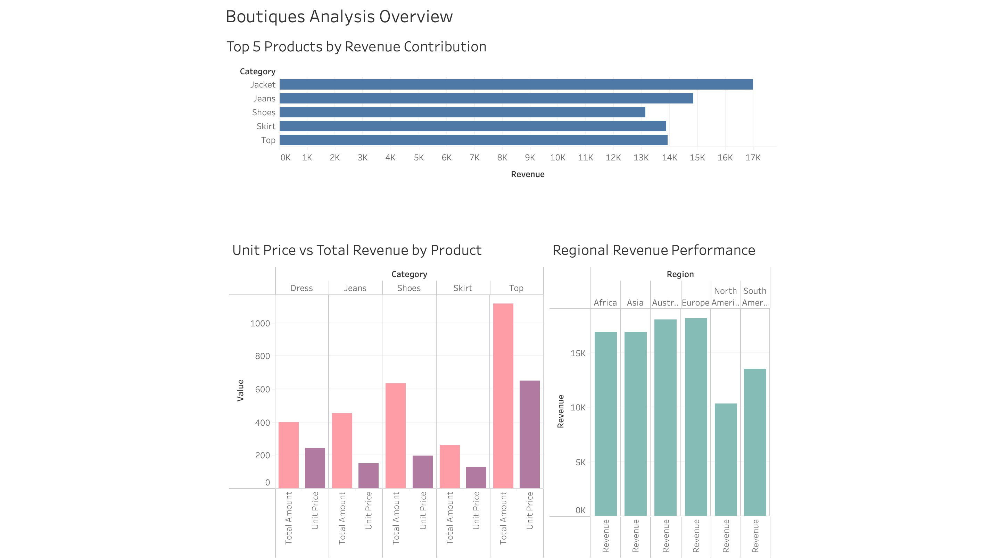

# Shopify Boutique Sales Analytics (Freelance Project)
**SQL | Python | Power BI | Data Analytics**
This project analyzes a simulated e-commerce dataset to uncover sales trends, customer behavior, and profitability patterns. Using SQL, Python, and Power BI, I created an end-to-end analytics workflow; from data cleaning to visualization — to demonstrate how data can drive business decisions.
---
## Shopify Boutique – Sales, Margins & Customer Insights
- Analyzing boutique Shopify store sales data to uncover profit levers, customer behavior, and regional performance indicators. — Delivered via SQL + Power BI dashboard.
---
## Project Objectives
- Identify top-performing products and categories by revenue and profit.
- Analyze regional performance to detect areas of high sales but low margins.
- Examine the impact of discounts on sales vs profitability.
- Segment customers by loyalty and evaluate their contribution to profit.
- Deliver a dashboard that highlights actionable insights for business stakeholders.
---
## Tools & Workflow
1. Python (pandas, numpy) → Cleaned & reshaped raw data for SQL import.
2. MySQL → Designed schema, ran advanced queries (sales trends, top customers, discount analysis).
3. Power BI → Built dashboards with sales, profit, and regional insights.
4. Excel → Quick validation & pivot table checks.

---
## Key Insights & Business Recommendations

**Product Performance**
- Top-selling products drove most of the revenue, but some categories had low or negative profit margins.
- Recommendation: Prioritize high-margin products in marketing and inventory decisions.

**Discounting Strategy**
- High discounts boosted sales volume but significantly reduced profitability.
- Recommendation: Refine discount policies — focus on targeted or seasonal discounts to protect margins.

**Customer Behavior**
- Repeat customers contributed over 60% of profits, despite being fewer in number.
- Recommendation: Launch loyalty programs and personalized marketing to retain this valuable segment.

**Regional Trends**
- The West region generated the highest sales but showed weaker margins compared to East and Central.
- Recommendation: Reassess regional pricing, logistics, or marketing spend in underperforming areas.
---
  # Dashboard Preview

## Confidentiality
This project is based on real freelance work. Client and store details are withheld for privacy. 

